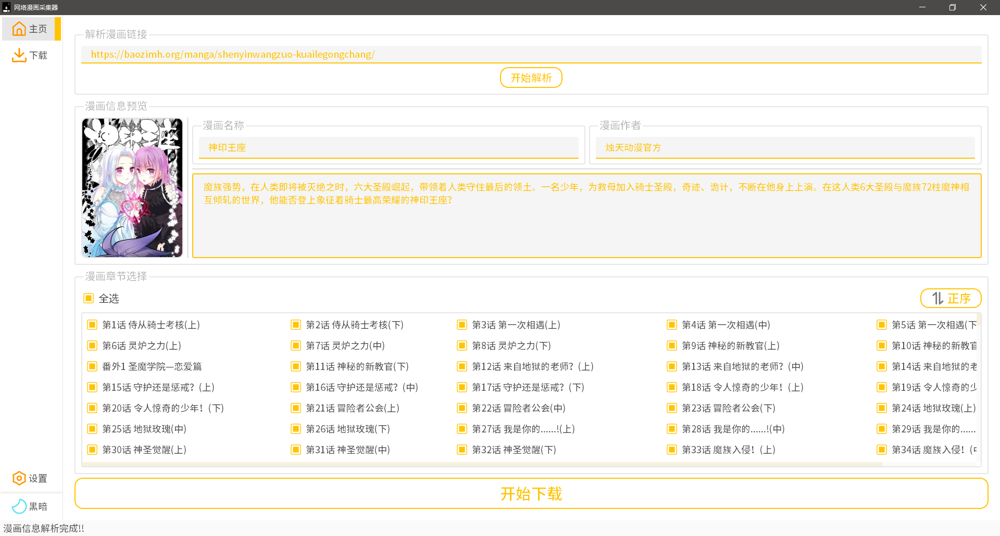
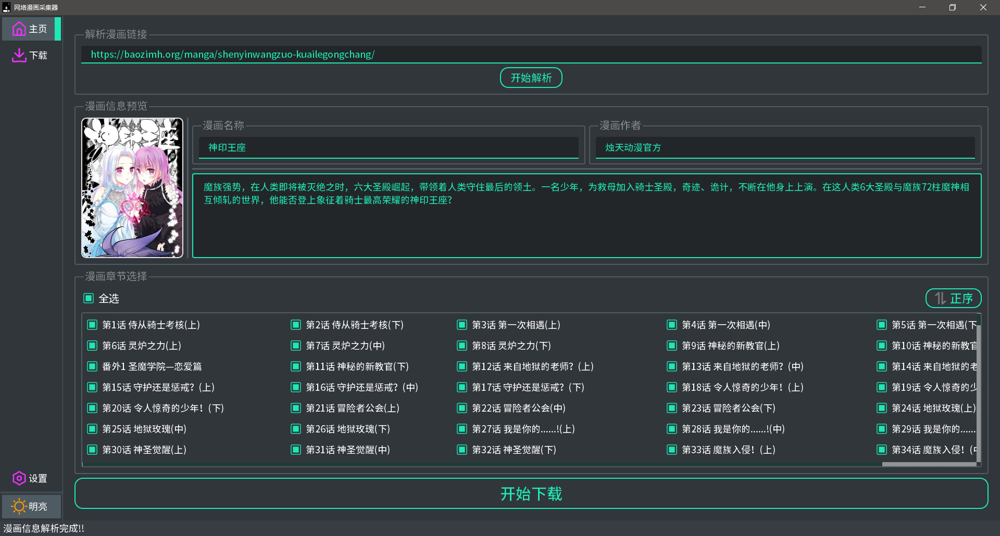
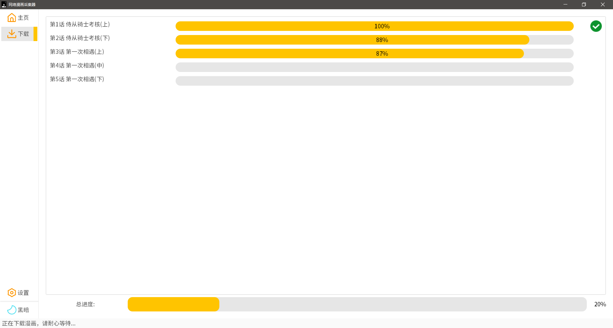

  

<h3 align="center">Comic-Downloader - 网络漫画下载器</h3>

---

## 📢 介绍

这是一款用于收集网络平台在线漫画的工具，使用Python构建。提供了简洁的GUI操作界面，方便用户在快速批量的下载喜欢的漫画内容，配合本地漫画阅读器，可以安心的阅读漫画。

**P.S. 软件还处在测试阶段，BUG非常的多，相关功能正在完善。**

## 💻 支持
| 支持平台 | 支持状况 |
|---|:---:|
| Windows | ✔️ |
| macOS | ❌ |
| UNIX, Linux | ❌ |
<!-- | Android | ❌ | -->

## 🎉 功能

1. [x] 批量下载
1. [x] 图形化界面
1. [x] 漫画信息预览
1. [x] 可选用暗色系主题
1. [ ] 多语言
1. [ ] 生成 cbz、cbr 文件
1. [ ] 元数据嵌入
1. [ ] 历史记录 

## 🌏 支持的网站

更多站点，敬请期待！

1. [包子漫画 (https://baozimh.org/)](https://baozimh.com)
1. [包子漫画(镜像) (https://baozimh.com/)](https://baozimh.com)

## 🖼 软件预览

||
---|---|---

## 🤝 参与项目

欢迎提交 [issue](https://github.com/zhy201810576/Comic-Downloader/issues) 以及 Pull Requests 。

所收集的漫画均来自网络，为了避免版权纠纷，只抓取免费漫画。
